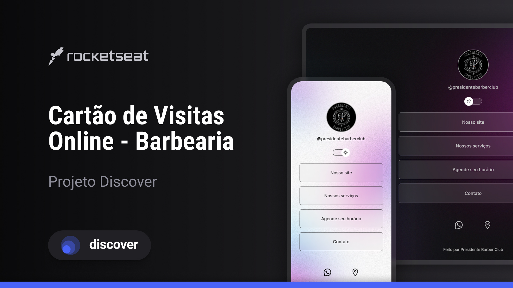

<h1 align="center"> Cartão de Visitas Online - Barbearia </h1>

Programa produzido por Pedro Najar Machado Gonzales para aprendizado de tecnologias WEB.

  <a href="#-tecnologias">Tecnologias</a>&nbsp;&nbsp;&nbsp;|&nbsp;&nbsp;&nbsp;
  <a href="#-projeto">Projeto</a>&nbsp;&nbsp;&nbsp;|&nbsp;&nbsp;&nbsp;
  <a href="#-layout">Layout</a>&nbsp;&nbsp;&nbsp;|&nbsp;&nbsp;&nbsp;
  <a href="#memo-licença">Licença</a>

  

 

  

## 🚀 Tecnologias

Esse projeto foi desenvolvido com as seguintes tecnologias:

- HTML e CSS
- JavaScript
- Git e Github
- Figma

## 💻 Projeto

O Cartão de Visitas Online é um projeto para agregar links e otimizar apresentações.

## 🔖 Layout

Você pode visualizar o layout do projeto através [DESSE LINK](<https://www.figma.com/file/MGKHD5N7ifxBOVH7UeA3Qy/DevLinks-%E2%80%A2-Projeto-Discover-(Community)?type=design&node-id=1-113&mode=design&t=ho86xm5a5C5JH9Zl-0>). É necessário ter conta no [Figma](https://figma.com) para acessá-lo.

## :memo: Licença

Esse projeto está sob a licença MIT.

---

Produzido por Pedro Najar Machado Gonzales, auxiliado pela [Rocketseat](https://rocketseat.com.br), para [Presidente Barber Club](https://www.google.com/search?q=presidente+barber+club&sca_esv=579562946&ei=zztHZdTyJO_X1sQPkoeDmA0&ved=0ahUKEwiUlpKDo6yCAxXvq5UCHZLDANMQ4dUDCBA&uact=5&oq=presidente+barber+club&gs_lp=Egxnd3Mtd2l6LXNlcnAiFnByZXNpZGVudGUgYmFyYmVyIGNsdWIyBhAAGBYYHjIGEAAYFhgeSNcZUM0EWIMYcAJ4AZABAJgBjQGgAZYJqgEDMC45uAEDyAEA-AEBwgIKEAAYRxjWBBiwA8ICBRAAGIAEwgIIEAAYFhgeGA_CAgIQJsICBRAhGKAB4gMEGAAgQeIDBRIBMSBAiAYBkAYI&sclient=gws-wiz-serp).
